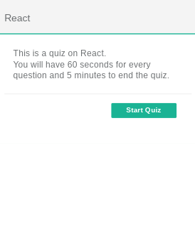
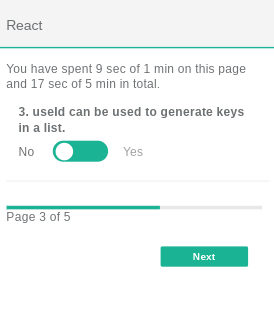
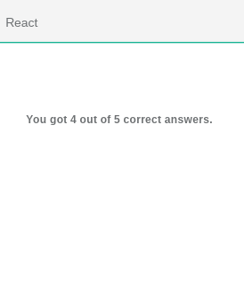

# Surveyjs Demo

The Survey Creator & Manager project idea from [50 Projects for React and the Static Web](https://50reactprojects.com) prompted me to discover and check out [Surveyjs](https://surveyjs.io).  I made a little react quiz with it and found the library to be easy to work with.  To recreate its functionality would be quite an undertaking.  

## Table of contents

- [Overview](#overview)
  - [Screenshot](#screenshot)
  - [Links](#links)

### Screenshot

### Links

- Live Demo: [Github Pages](https://jdegand.github.io/surveyjs-demo)
